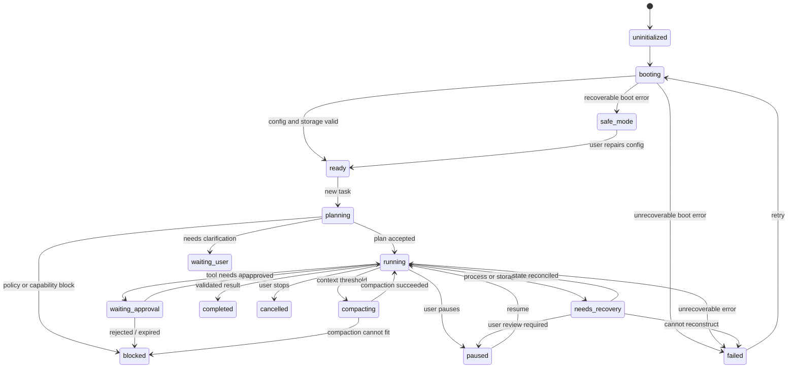
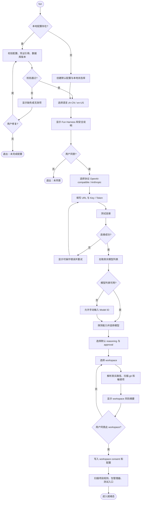
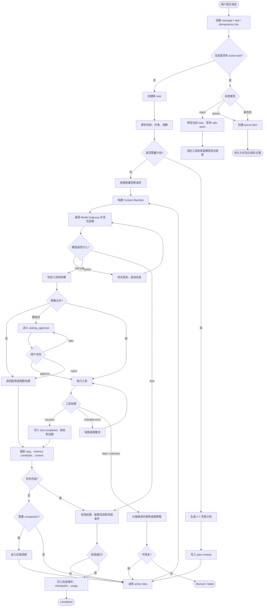
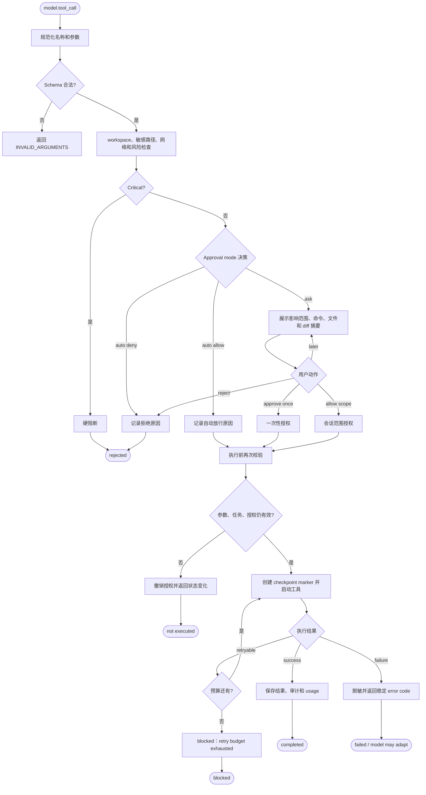
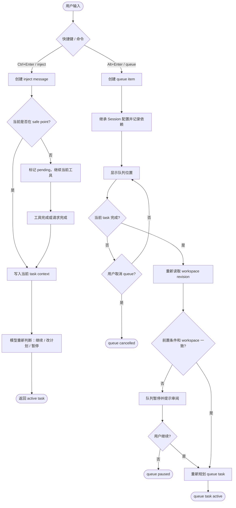
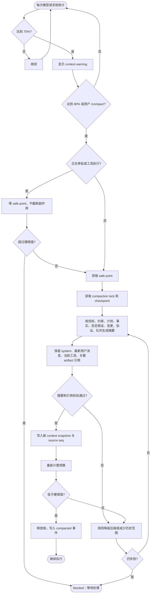
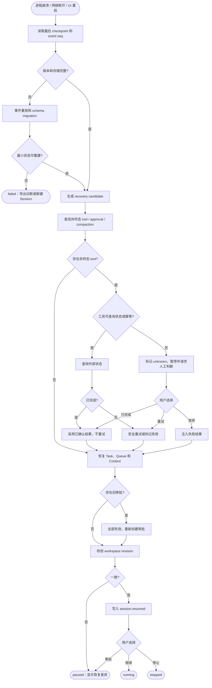

# Fun Harness 核心流程图

> 本文是 Fun Runtime 的流程图资料，不是传统 Web API 的业务事件系统。图中的 API、应用服务和领域逻辑分别对应 CLI 输入层、Task Orchestrator 和 Agent Runtime；事件存储是 Session Event Store，工具执行、审批和模型流都必须经过 Runtime。

> 本文描述 Fun 的 Core Runtime 生命周期。带有 Queue、自动压缩、完整崩溃恢复或 web_search 的图属于 V1.x 设计预留；V1 实现必须只交付文末的 Core 范围。所有状态变化都必须先持久化为事件，再通知终端 UI；所有工具调用都有唯一 `task_id`、`turn_id`、`call_id` 和幂等键。

## 0. 统一约定

终态：

```text
completed / cancelled / rejected / failed / blocked / needs_recovery
```

恢复原则：

1. 已持久化的事实优先于模型叙述。
2. 非终态工具在崩溃后不能直接假定成功或失败。
3. 不确定的外部副作用不自动重试。
4. 所有恢复、压缩、审批、队列切换都有事件记录。

## 1. 全局 Runtime 状态



## 2. 首次启动与 Workspace Onboarding



## 3. 一次 Task 执行



## 4. Tool Call 与 Approval



## 5. Inject 与 Queue（V1.x 预留）



## 6. Context Compaction（V1：人工 `/compact`；自动流程为 V1.x）



## 7. 崩溃与恢复（V1：基础 stop/replay；完整 unknown side-effect UI 为 V1.x）



## 8. V1 / V1.x 实现标注

| 流程 | V1 Core | V1.x |
|---|---:|---:|
| Onboarding、单 workspace、单 active Task | ✓ | |
| 串行 Tool Call、Ask/Smart/Auto、diff、validation、checkpoint、stop | ✓ | |
| 基础事件写入和 Session replay | ✓ | |
| Inject 与 Queue | | ✓ |
| 自动 Context Compaction | | ✓ |
| 完整 unknown side-effect recovery UI | | ✓ |
| Anthropic、动态模型发现、web_search | | ✓ |

流程图展示的是完整演进目标；实现 PR 必须在标题和验收标准中声明属于 Core、V1.x 还是 Future。

## 9. 任务完成判定

任务不是模型说“完成了”就完成。Runtime 至少检查：

```text
用户目标是否有结果
计划中必须完成的步骤是否完成或明确跳过
文件变更是否记录
diff 是否可读取
相关验证是否执行或明确未执行
未解决风险是否展示
是否存在 pending approval / pending queue / unknown tool
```

只有通过这些条件，才写入 `task.completed`。否则是 `blocked`、`needs_user` 或 `failed`。
